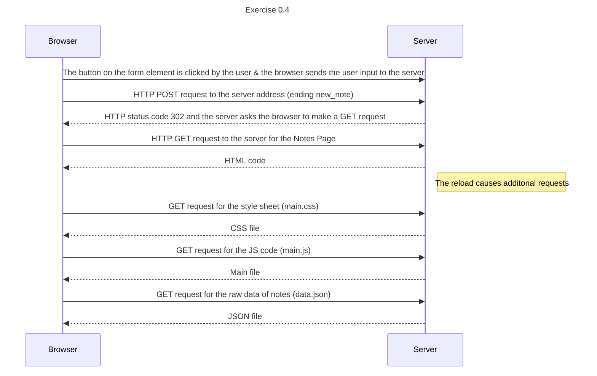

```mermaid
sequenceDiagram;
    title: Exercise 0.4
    participant Browser
    participant Server

    Browser ->> Server: The button on the form element is clicked by the user & the browser sends the user input to the server
    Browser ->> Server: HTTP POST request to the server address (ending new_note)
    Server -->> Browser: HTTP status code 302 and the server asks the browser to make a GET request
    Browser ->> Server: HTTP GET request to the server for the Notes Page
       Server -->> Browser: HTML code
    Note right of Server: The reload causes additonal requests
    Browser ->> Server: GET request for the style sheet (main.css)
    Server -->> Browser: CSS file
    Browser ->> Server: GET request for the JS code (main.js)
    Server -->> Browser: Main file
    Browser ->> Server: GET request for the raw data of notes (data.json)
    Server -->> Browser: JSON file
```