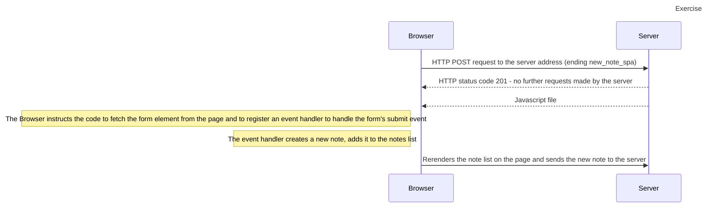

```mermaid
sequenceDiagram;
    title: Exercise 0.5
    participant Browser
    participant Server
    
    Browser ->> Server: HTTP POST request to the server address (ending new_note_spa)
    Server -->> Browser: HTTP status code 201 - no further requests made by the server
    Server -->> Browser: Javascript file 
    Note left of Browser: The Browser instructs the code to fetch the form element from the page and to register an event handler to handle the form's submit event
    Note left of Browser: The event handler creates a new note, adds it to the notes list
    Browser ->> Server: Rerenders the note list on the page and sends the new note to the server
```